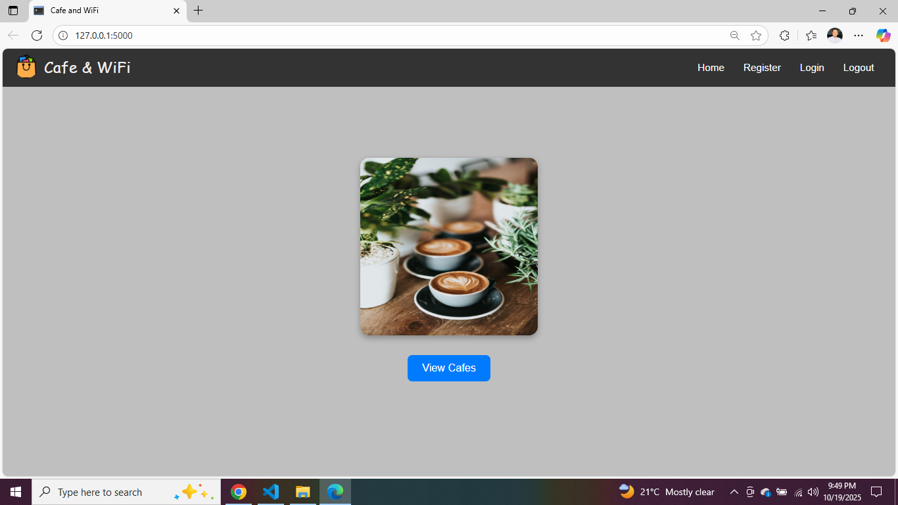
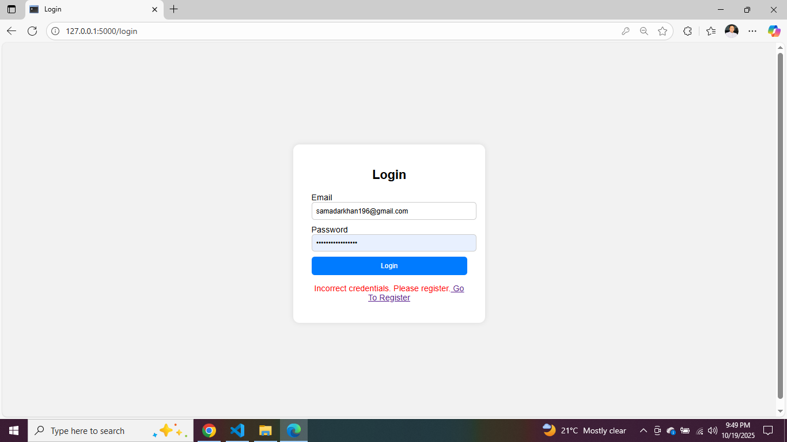
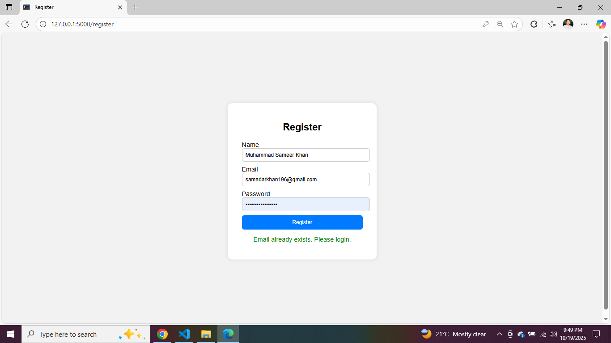
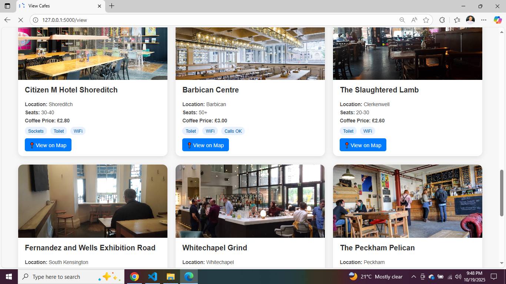

# ☕ Cafe and WiFi

Cafe and WiFi is a Flask web application where users can register, log in, and explore cafes that provide WiFi, sockets, and great ambiance for work or study.  
All data is stored in an SQLite database and displayed with a clean, user-friendly interface.

---

## 🌐 Features
- User Registration and Login using Flask-WTF Forms  
- SQLite Database for storing users and cafe details  
- Dynamic Cafe Listings with images and details  
- Simple and responsive user interface  

---

## 📸 Screenshots

### 🏠 Home Page
Displays the main landing page with a beautiful cafe image and navigation bar.

### 🔐 Login & Register
Secure authentication system allowing new users to register and existing users to log in.

### 👋 Welcome Page
After logging in, users are greeted with a personalized welcome message.

### ☕ View Cafes
Displays all cafes from the database with their details such as WiFi availability, sockets, and coffee prices.

---

## ⚙️ Tech Stack
- **Python (Flask Framework)**
- **SQLite Database**
- **HTML, CSS (Frontend Design)**

## Run the Flask application
python main.py

## 👨‍💻 Author
** Developed by [Muhammad Sameer] — a simple yet powerful Flask project for learning and practice. **

---

Would you like me to make the README include a “Database Schema” section (with a table diagram of the `register` and `cafe` tables)? It makes the project look more professional on GitHub.

